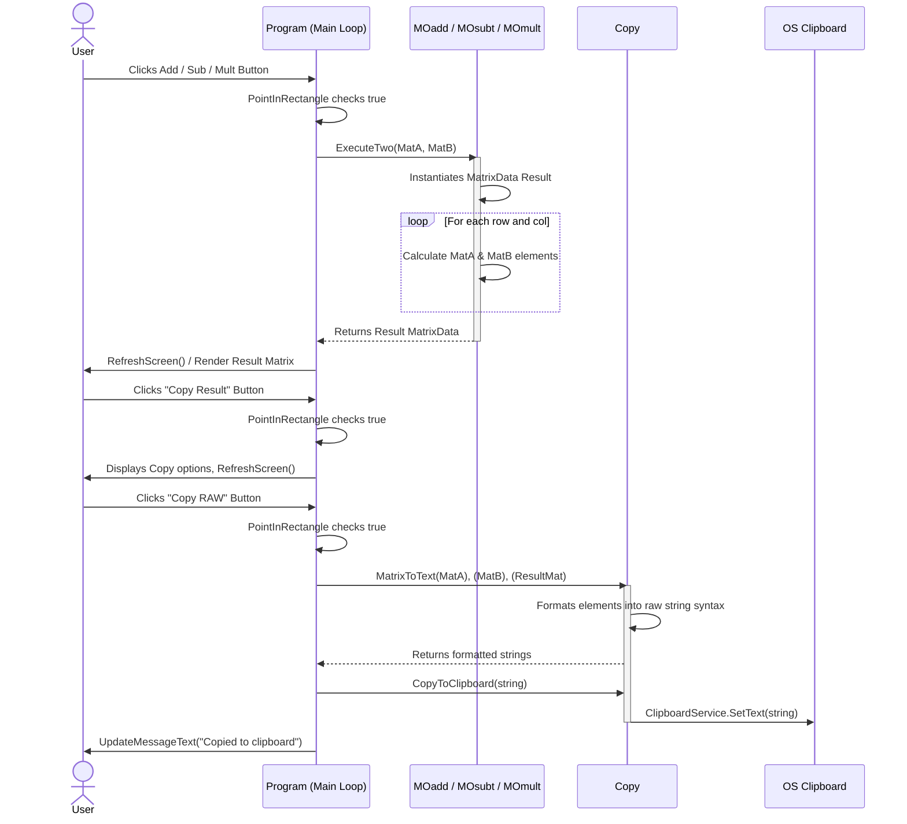

# Matrix-Calculator

Welcome to the custom Matrix Calculator project! Below you will find the architectural design diagrams that define the structure and behavior of the system.

## System UML Class Diagram

This Class Diagram maps out the core Object-Oriented principles, including the Memento, Strategy, and Factory patterns defined in the project schema.
This sequence diagram shows 2 Martix Operations (Addition, Subtraction, Multiplication), Copying RAW Result

