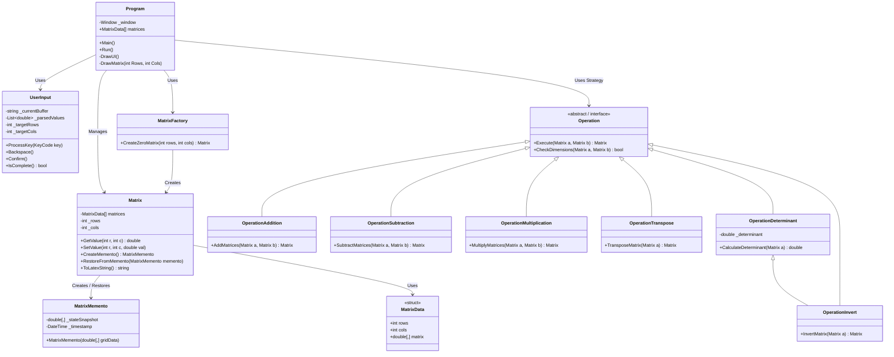
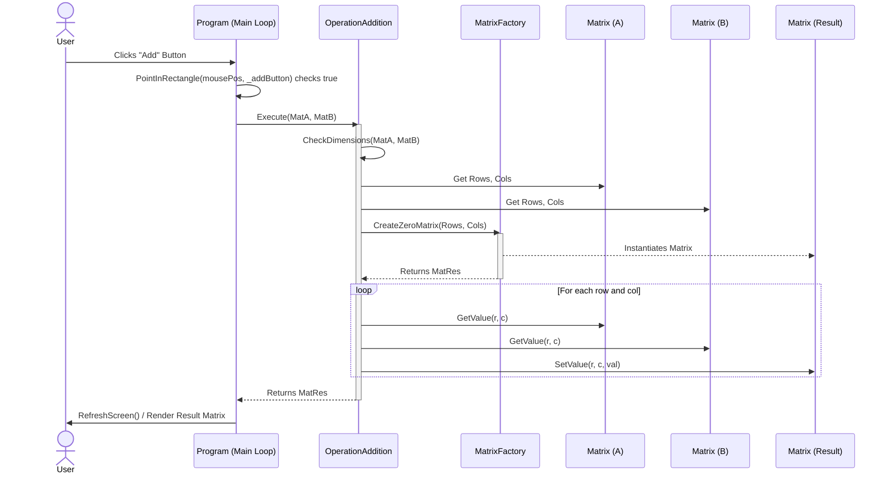

# Matrix-Calculator - Custom-Project

Welcome to the custom Matrix Calculator project! Below you will find the architectural design diagrams that define the structure and behavior of the system.

## System UML Class Diagram

This Class Diagram maps out the core Object-Oriented principles, including the Memento, Strategy, and Factory patterns defined in the project schema.

## System Sequence Diagram

Below is the UML Sequence Diagram demonstrating the behavioral flow of the application when a user performs a mathematical operation (e.g., Matrix Addition) using the Strategy Pattern.

