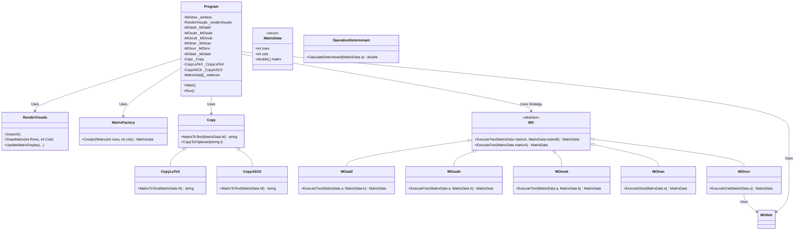

# System UML Class Diagram

Below is the UML Class Diagram for the Matrix Calculator application. It maps out the core Object-Oriented principles, including the Memento, Strategy, and Factory patterns defined in `SCHEMA.md`.

To view this diagram, view this file in a markdown editor that supports Mermaid.js (such as Obsidian, GitHub, or VS Code with a Mermaid extension).

