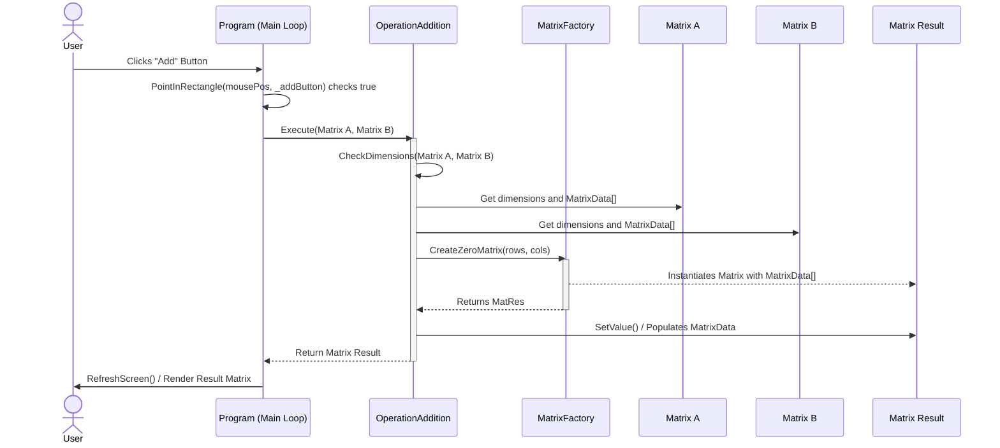

# System Sequence Diagram

Below is the UML Sequence Diagram demonstrating the behavioral flow of the application when a user performs a mathematical operation (e.g., Matrix Addition) using the Strategy Pattern.

To view this diagram, view this file in a markdown editor that supports Mermaid.js (such as Obsidian, GitHub, or VS Code with a Mermaid extension).

