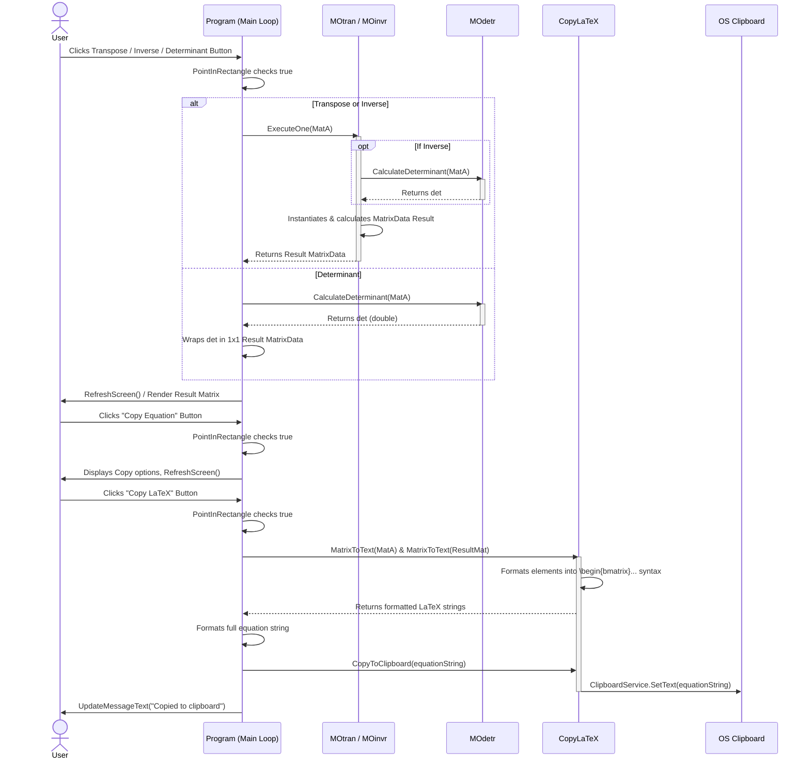
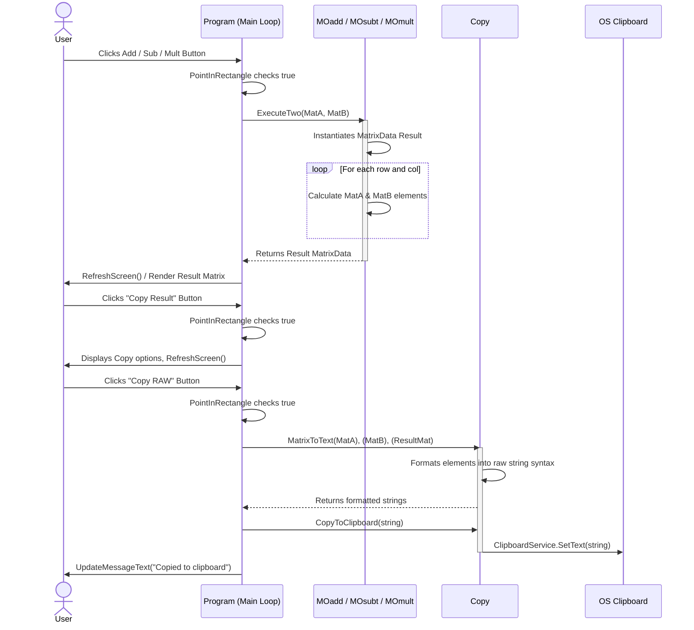

# System Sequence Diagrams

There are multiple ways the data flows in the program, so I included multiple diagrams.

## 1 Matrix Operations (Transpose, Inverse, Determinant), Copying LaTeX Equation

## 2 Martix Operations (Addition, Subtraction, Multiplication), Copying RAW Result
Handles operations requiring both Matrix A and Matrix B

